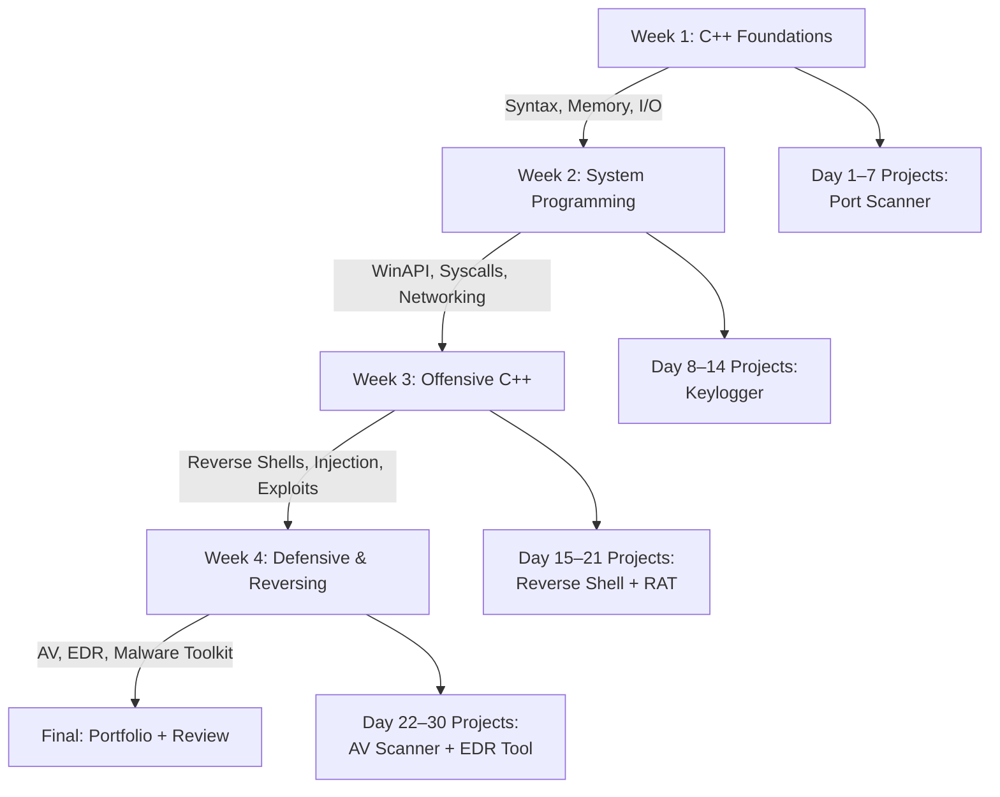

# 🔐 C++ Cybersecurity Study Planner — 30 Days

This repository contains a structured **30-day learning roadmap** focused on applying C++ in cybersecurity domains such as **malware development concepts, exploit fundamentals, system programming, reverse engineering, and defensive security tool development**.

The planner is designed for:
- Cybersecurity beginners learning low-level programming  
- Students preparing for SOC / Malware Analysis / DFIR roles  
- Developers transitioning into systems security  
- Anyone wanting hands-on experience with OS-level security tools  

---

# 📊 Visual Overview — Learning Flowchart

# 📅 30-Day Learning Plan — C++ for Cybersecurity

---

## 🗓️ Week 1 — C++ Foundations for Cybersecurity

### 🎯 Objective  
Build the fundamentals needed for system-level and security programming.

### 📘 Topics Covered
- Syntax, control flow, functions  
- Pointers, memory (stack/heap)  
- Arrays, buffers, overflow basics  
- File I/O  
- OOP essentials  

### 🛠 Project  
✔ **TCP Port Scanner**

---

## 🗓️ Week 2 — System Programming

### 🎯 Objective  
Understand how malware and security tools interact with OS internals.

### 📘 Topics Covered
- Processes, threads, virtual memory  
- System commands execution  
- Windows API & Linux syscalls  
- Raw socket programming  
- Multithreading, mutex, race conditions  
- Secure coding  

### 🛠 Project  
✔ **Keylogger**

---

## 🗓️ Week 3 — Offensive C++ Development

### 🎯 Objective  
Study attacker techniques (ethically) to build defensive understanding.

### 📘 Topics Covered
- Reverse shell architecture  
- DLLs & shared libraries  
- DLL injection  
- Process hollowing  
- Memory forensics  
- Buffer overflow fundamentals  

### 🛠 Projects  
✔ **Reverse Shell**  
✔ **Lightweight RAT**

---

## 🗓️ Week 4 — Defensive Security & Malware Analysis

### 🎯 Objective  
Reverse-engineer malicious programs and build defensive tools.

### 📘 Topics Covered
- Binary analysis (strings, objdump, hexdump)  
- Ghidra, IDA Free, x64dbg basics  
- Assembly related to C++  
- Obfuscation (XOR encoder, packers)  
- Antivirus scanning (signature + hashing)  
- API hooking  
- Process monitoring  

### 🛠 Projects  
✔ **Antivirus Scanner**  
✔ **EDR Process Monitor**  
✔ **Malware Analysis Toolkit**

---

# 🛠 Projects Included

| Project                | Description                         |
|------------------------|-------------------------------------|
| Port Scanner           | Basic network enumeration tool       |
| Keylogger              | Captures keystrokes using OS APIs    |
| Reverse Shell          | Remote command execution             |
| RAT                    | Lightweight command & control tool   |
| XOR Encoder            | Obfuscation mechanism                |
| Antivirus Scanner      | Hash + signature detection           |
| EDR Monitor            | Process + API monitoring             |
| Malware Toolkit        | Integrated analysis suite            |

---

# 🧠 Skills You Will Gain

### 💻 Programming Skills
- Pointers & memory management  
- File operations  
- OOP for tool structuring  
- Multithreading  

### 🖥️ OS-Level Skills
- Windows API  
- Linux syscalls  
- Process/thread handling  
- DLL injection fundamentals  

### 🔐 Security Skills
- Network programming  
- Malware behavior analysis  
- Reverse engineering  
- AV & EDR tool development  
- Obfuscation & basic cryptography  

---

# 📦 Requirements

### 🖥️ System Requirements
- Windows or Linux machine  
- g++, MSVC, or MinGW  

### 🔧 Optional (Recommended)
- Virtual Machine  
- Tools:  
  - **Ghidra**  
  - **x64dbg**  
  - **Process Hacker**  
  - **Wireshark**

